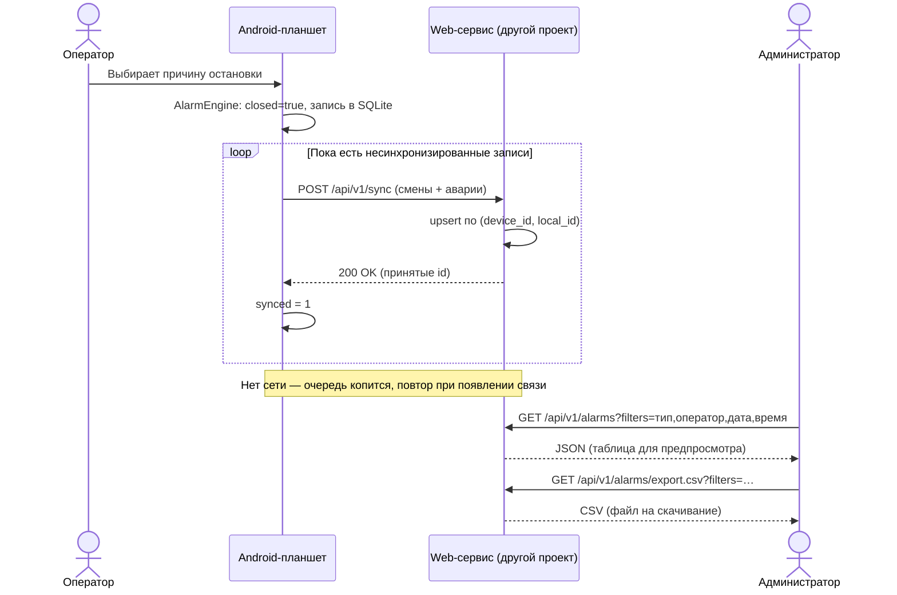

# Спецификация: передача данных в web-проект

Задача приоритета 1 (версия 0.3.0) из [`PLAN.md`](PLAN.md).

**Границы:** web-приложение (сервер, БД, кабинет администратора, выгрузка и
фильтры) — **отдельный проект**, здесь не разрабатывается. Этот документ
описывает только то, что должен делать **планшет**: отдавать аварии и смены,
чтобы web мог строить отчёты.

> В этом репозитории web-версии нет — есть только Android-приложение.

## Роли

| Роль | Где | Действия |
|------|-----|----------|
| Оператор | планшет (Android) | Ведёт смену, указывает причины. Без выгрузки. |
| Администратор | web (другой проект) | Смотрит и выгружает аварии с фильтрами. |

## Что и зачем передаём

Web должен уметь фильтровать по четырём параметрам — значит планшет обязан
передавать соответствующие поля без потерь:

| Фильтр web | Нужные данные с планшета |
|------------|--------------------------|
| **Тип аварии** | `cause_code`, `cause_path`, `cause_text` |
| **Кто был на смене** | смена: `operator`, `start_time`, `end_time`; у аварии — `shift_id` |
| **Какая дата** | `stop_time` (начало аварии), локальное время планшета |
| **Время** | тот же `stop_time`; дополнительно `start_time`, `duration_ms` |

Прочие полезные поля: `id`, `closed`, `start_counter` (`D1`), `device_id`.

## Схема взаимодействия

Общая картина: планшет — источник данных, web-сервис (другой проект) — приёмник
и поставщик отчётов.

```
        ОПЕРАТОР                 ПЛАНШЕТ (Android)                WEB-СЕРВИС                     АДМИН
                                                                 (другой проект)
            │                          │                              │                            │
            │  выбирает причину        │                              │                            │
            ├─────────────────────────►│                              │                            │
            │                          │ AlarmEngine: closed = true,  │                            │
            │                          │ SQLite: alarms / shifts      │                            │
            │                          │                              │                            │
            │                          │  POST /api/v1/sync           │                            │
            │                          │  (смены + аварии, батч)      │                            │
            │                          ├─────────────────────────────►│  upsert по                 │
            │                          │                              │  (device_id, local_id)     │
            │                          │  200 OK (принятые id)        │                            │
            │                          │◄─────────────────────────────┤                            │
            │                          │  synced = 1                  │                            │
            │                          │                              │                            │
            │       нет сети: записи копятся в очереди, повтор позже  │                            │
            │                          │                              │                            │
            │                          │                              │  GET /api/v1/alarms?filters│
            │                          │                              │◄───────────────────────────┤
            │                          │                              │  (тип, оператор, дата,     │
            │                          │                              │   время)                   │
            │                          │                              │  JSON: таблица             │
            │                          │                              ├───────────────────────────►│
            │                          │                              │                            │
            │                          │                              │  GET /alarms/export.csv    │
            │                          │                              │◄───────────────────────────┤
            │                          │                              │  CSV (скачивание)          │
            │                          │                              ├───────────────────────────►│
```

То же в виде диаграммы последовательности (Mermaid):



## Контракт обмена (предлагаемый)

`POST /api/v1/sync` — батч смен и аварий, идемпотентный upsert по ключу
`(device_id, local_id)`.

```json
{
  "deviceId": "d3f1…-uuid",
  "shifts": [
    {
      "localId": 12,
      "operator": "Иванов",
      "startTime": 1758500000000,
      "endTime": 1758536000000
    }
  ],
  "alarms": [
    {
      "localId": 37,
      "shiftLocalId": 12,
      "stopTime": 1758512345000,
      "startTime": 1758512400000,
      "durationMs": 55000,
      "causeCode": 41,
      "causePath": "Автомат фасовки / 1. Формовка + протяжка / 1.1 Заклинил главный привод",
      "causeText": null,
      "closed": true,
      "startCounter": 128
    }
  ]
}
```

Способ аутентификации планшета и точные имена полей согласуются с web-проектом.

## Изменения на планшете

- Каждой установке присваивается `device_id` (UUID), хранится в
  `SharedPreferences`.
- Схема БД поднимается до **v3**: в `alarms` и `shifts` добавляются
  `device_id TEXT` и `synced INTEGER NOT NULL DEFAULT 0` (либо отдельная таблица
  `sync_queue`).
- Фоновый воркер (корутина) периодически отправляет несинхронизированные
  записи и помечает их `synced = 1` только после успешного ответа.
- При отсутствии сети записи накапливаются и отправляются позже; повторная
  отправка не создаёт дубликат на сервере (идемпотентность).
- `AlarmEngine` и офлайн-работа планшета не меняются: синхронизация — побочный
  процесс, не влияющий на фиксацию аварий.

## Чего в этом репозитории НЕ делаем

- Не пишем backend/API/HTTP-сервер.
- Не генерируем CSV/Excel и не рисуем фильтры — это web-проект.
- Не реализуем web-авторизацию администратора.

## Тесты и проверка

- Android: сборка payload-а (маппинг `AlarmRecord`/`ShiftRecord` → JSON) —
  чистая функция, покрывается unit-тестом.
- Логика очереди/повтора — по возможности чистые функции + тесты.
- Тесты `AlarmEngine` и Python-эмулятор не затрагиваются, но `py -3 -m unittest
  discover -s simulator -p "test_*.py" -v` должен оставаться зелёным.
- Интеграционная приёмка совместно с web-проектом (мок-сервер или тестовый
  стенд).

## Критерии готовности

- [ ] Контракт обмена согласован с web-проектом.
- [ ] Планшет отправляет смены и аварии, повторная отправка не даёт дублей.
- [ ] Передаются поля, достаточные для фильтров «тип аварии», «кто был на
      смене», «дата», «время».
- [ ] Работа офлайн: данные не теряются и уходят при появлении связи.
- [ ] `CHANGELOG.md` дополнен; при релизе подняты `versionCode`/`versionName`.

## Открытые вопросы

- Точный API и авторизация со стороны web-проекта.
- Сетевой доступ планшета до сервера (подсеть/VPN).
- Обратный поток: нужно ли получать справочник причин/операторов с сервера.
